# FOC Onchain Platform Stack Specification

Status: Draft / v1 finalization spec
Owner: FOC client engineering  
Last updated: 2026-07-01
Related repos:

- `~/dev/filozone/synapse-sdk`
- `~/dev/fil-builders/foc-cli`
- `~/dev/fil-builders/foc-storage-mcp`
- `~/dev/tokenhost/tokenhost-builder`

## 1. Purpose

This document defines a reusable platform stack that enables a platform company to offer Filecoin Onchain Cloud storage to its own users while minimizing platform-managed offchain state.

The target model is:

1. End users interact with a platform API, UI, generated app, or agent.
2. User storage actions are authorized, metered, and auditable through platform-specific smart contracts.
3. A platform-managed wallet, contract wallet, or treasury pays Filecoin Onchain Cloud for storage activity.
4. User-level usage, quotas, prepaid balances, billing events, and object ownership are tracked primarily onchain.
5. Offchain infrastructure remains as stateless and replaceable as possible. Its main responsibilities are byte movement, FOC SDK execution, relaying, optional indexing, and operational coordination.

This revision selects a concrete v1 path while preserving future modes as explicit compatibility gates. Production contract work should follow the v1 decisions below unless the Phase 0 compatibility report records evidence that requires a change. Token Host Builder is the preferred v1 scaffolding path for generated app surfaces, admin/read UI, upload adapters, manifests, and transaction UX, but section 6.7 remains the authoritative protocol/API surface until a generated custom module proves equivalence.

## V1 Architecture Decisions

The v1 platform stack uses a **platform EOA/KMS payer, FOC session keys, a platform-hosted coordinator, and platform contracts for request, object, usage, and receipt state**.

These decisions are normative for v1:

1. **FOC payer/root:** the platform operates an EOA or KMS-managed wallet as the FOC root/payer. That wallet funds Filecoin Pay, approves the required FOC operators, owns or controls FOC datasets, and grants coordinator session keys.
2. **Coordinator authority:** a platform-hosted coordinator is the only v1 executor. It is allowlisted in the Platform Contract Stack and uses a FOC session key authorized by the platform root wallet. Direct root signing is an emergency/operator fallback, not the default execution path.
3. **Contract responsibility:** platform contracts do not move bytes and do not directly pay FOC in v1. They record upload requests, object ownership, quota/cost reservations, compact FOC receipts, usage counters, coordinator allowlists, and reconciliation anchors.
4. **Billing mode:** v1 supports quota and credit-style accounting first. The platform pays FOC externally through the EOA/KMS root and records chargeable usage onchain. User USDFC custody in a Platform Treasury is deferred until Phase 0 proves the contract-treasury path.
5. **Dataset attribution:** FOC datasets should be attributable to one platform account and provider tuple. The v1 target is one dataset namespace per `(accountId, providerId, cdnMode, storageClass)` when the underlying FOC surface allows it.
6. **Receipts:** v1 stores compact receipt fields in contract storage and emits richer event detail. A finalized platform object must be reconcilable to FOC provider, dataset, piece, payer, and tx evidence without requiring coordinator-private state.
7. **Upload lifecycle:** v1 upload requests are async. The platform API creates an onchain request, the coordinator uploads and commits through FOC, then the coordinator finalizes the request with a receipt or marks it failed.
8. **Authorization:** v1 accepts direct user transactions, authorized relays, or EIP-712 user signatures. If a normal platform API authenticates users offchain, the relayer is accountable for mapping that API user to an opaque onchain `accountId`.
9. **Token Host:** Token Host Builder is a v1 scaffolding dependency for the demo app, admin/read surfaces, upload adapters, manifest metadata, and sponsored transaction wiring. It is not allowed to weaken the section 6.7 contract/API semantics: generic CRUD output may wrap, index, or prototype the platform state, but any generated production module must match the upload lifecycle, coordinator-only finalization, compact receipt, dataset/copy, and usage-accounting rules in this spec.
10. **Phase 0 gate:** before production contract implementation, the team must complete the Phase 0 Compatibility Report Template in section 13.1. The report must include transaction hashes or logs for every required compatibility claim.

The following modes are explicitly **not** v1 defaults and require Phase 0 evidence plus a spec update before implementation:

- Platform smart account as FOC root/payer.
- Platform treasury contract directly holding USDFC and paying FOC.
- User wallet pays FOC directly while platform only records usage.
- Browser direct-to-FOC upload as the primary data plane.
- Bring-your-own or user-local coordinator execution.
- Challenge/proof-based finalization replacing trusted coordinator finalization.
- Shared cross-user FOC datasets as the default allocation strategy.

## 2. Product Goal

Build a reusable **FOC Platform Stack** for companies that want to build higher-level products on Filecoin Onchain Cloud.

The stack should make the following flow straightforward:

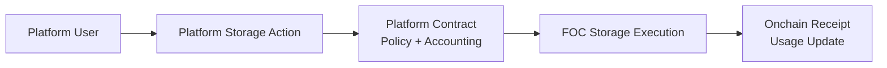

The platform should be able to expose simple product APIs such as:

```http
POST /storage/upload
GET  /storage/objects/:id
GET  /usage
```

while using contracts as the primary system of record for:

- who requested storage,
- which object was stored,
- how much storage was consumed,
- which user or account should be charged,
- which FOC datasets, providers, or pieces were used,
- whether platform policy allowed the action,
- and which settlement or accounting event occurred.

## 3. Design Principles

### 3.1 Onchain-first accounting

The authoritative usage ledger SHOULD live onchain when economically viable.

Offchain services MAY cache, index, or mirror state, but correctness should derive from contract state and emitted events.

### 3.2 Minimal offchain state

Offchain components SHOULD avoid owning critical business state. Where offchain state is unavoidable, it should be:

- temporary,
- reconstructable from chain events,
- idempotent,
- or explicitly marked as non-authoritative.

### 3.3 Execution/state separation

Contracts SHOULD own policy and accounting. Offchain coordinators SHOULD perform execution that contracts cannot perform directly, especially:

- receiving file bytes,
- uploading bytes to FOC providers,
- using Synapse SDK,
- submitting FOC-related transactions,
- and calling back with receipts.

### 3.4 Flexible wallet model

The v1 wallet model is platform EOA/KMS payer with FOC session keys. The stack MUST keep future wallet and payment modes isolated behind explicit compatibility gates so that smart-account, treasury, user-pays, and hybrid prepaid modes can be added without changing v1 object and usage semantics.

### 3.5 Auditability over full trustlessness

The initial product may rely on a trusted platform coordinator or operator. The important requirement is that user actions, platform decisions, and storage receipts are auditable onchain.

### 3.6 No privacy illusions

Onchain metadata is public. The stack MUST NOT store secrets or sensitive PII onchain. User identifiers should be opaque IDs or addresses. File metadata should be minimized or hashed when possible.

## 4. Scope

### 4.1 In scope

- Platform Contract Stack components for storage registry, usage ledger, policy, treasury, and receipt recording.
- User storage intents and authorization.
- Onchain object registry.
- Onchain usage/accounting ledger.
- Quotas, prepaid balances, or spend caps.
- FOC upload coordinator scaffold.
- Synapse SDK integration.
- Token Host Builder-first integration for generated app surfaces, admin/read UI, upload adapters, manifest metadata, onchain indexing, and sponsored transaction scaffolding.
- Optional sponsored transaction / gasless UX.
- Optional offchain indexer or cache.
- Compatibility testing for contract wallets and FOC payment flows.

### 4.2 Out of scope for v0

- Eliminating all offchain infrastructure.
- Uploading bytes directly from smart contracts.
- Building a full fiat invoicing product.
- Guaranteed private storage metadata.
- Decentralized coordinator marketplace.
- Replacing Synapse SDK.

## 5. Core Architecture

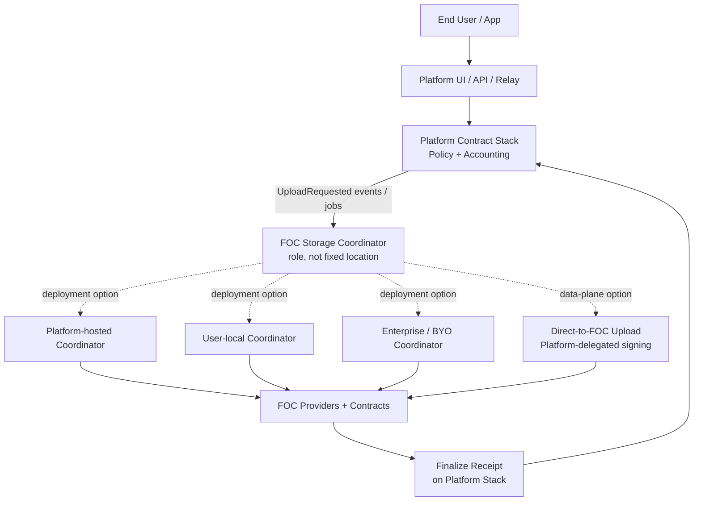

The **FOC Storage Coordinator** is an execution and coordination role, not necessarily a platform-owned server. In v1, the default coordinator is expected to be platform-hosted. The same contract model should still support user-local, enterprise self-hosted, serverless, or direct-to-FOC data-plane variants.

The **Platform Contract Stack** remains the authoritative policy and accounting layer regardless of where the coordinator executes.

### 5.1 Execution role terminology

This spec uses **FOC Storage Coordinator** as the umbrella term for the component, service, or set of components that turns an approved platform storage request into an actual FOC storage operation and records the result.

A FOC Storage Coordinator may be one service in v1 or may be split across browser, server, signer, and worker components. It may include these sub-roles:

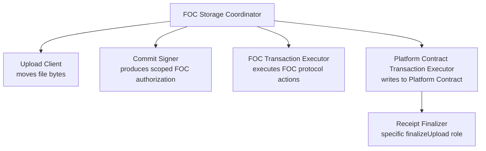

Definitions:

- **Upload Client**: moves file bytes. This may be a browser, platform backend, local CLI, enterprise agent, or serverless function.
- **Commit Signer**: produces scoped FOC authorization/signatures, often using a platform session key, KMS signer, root wallet, or future smart-account signer.
- **FOC Transaction Executor**: submits or triggers FOC protocol actions such as dataset creation, adding pieces, scheduling deletion, payment preparation, or provider/FWSS calls through Synapse SDK.
- **Platform Contract Transaction Executor**: submits transactions to a Platform Contract, such as `requestUpload(...)`, `finalizeUpload(...)`, `failUpload(...)`, and usage/billing updates.
- **Receipt Finalizer**: the Platform Contract Transaction Executor role for the specific `finalizeUpload(...)` path.

In this spec, **Platform Contract** means a platform-specific onchain contract deployed to Filecoin/EVM for product/accounting state. It does not mean the platform API itself is onchain; the platform can remain a normal offchain API/product service.

**Platform Contract Stack** means the set of Platform Contracts that together implement storage registry, usage ledger, policy, treasury, and receipt-recording concerns.

## 6. Platform Contract Stack

The contract stack MAY be implemented as one contract for an MVP or as multiple contracts for modularity.

Sections 6.1 through 6.6 describe component responsibilities and design context. Section 6.7 is the normative v1 contract/API surface.

### 6.1 `PlatformStorageRegistry`

Tracks storage objects and upload lifecycle.

Potential fields:

```solidity
struct StorageObject {
  uint256 objectId;
  address user;
  bytes32 externalUserIdHash;
  bytes32 contentHash;
  string pieceCid;
  uint256 size;
  uint8 requestedCopies;
  uint8 completedCopies;
  bool withCDN;
  UploadStatus status;
  uint256 createdAt;
  uint256 updatedAt;
}
```

Potential statuses from earlier design exploration. These are not the v1 status values; the normative v1 `UploadStatus` enum is defined in section 6.7.2.

```solidity
enum UploadStatus {
  None,
  Requested,
  Accepted,
  Uploading,
  Committed,
  Partial,
  Failed,
  Deleted,
  Archived
}
```

Non-normative storage options considered before the v1 surface in section 6.7:

- Store `pieceCid` as a string.
- Store PieceCID as bytes or multihash parts.
- Store only `bytes32 pieceCidHash` plus event data.
- Store provider/dataset details in the primary object struct.
- Store provider/dataset details in separate copy records.

### 6.2 `PlatformUsageLedger`

Tracks user/account usage and chargeable events.

Potential fields:

```solidity
struct AccountUsage {
  uint256 activeBytes;
  uint256 activeObjects;
  uint256 monthlyRateEstimate;
  uint256 prepaidBalance;
  uint256 reservedBalance;
  uint256 totalCharged;
  uint256 totalUploadedBytes;
}
```

Potential events:

```solidity
event UsageReserved(address indexed user, uint256 indexed objectId, uint256 amount);
event UsageFinalized(address indexed user, uint256 indexed objectId, uint256 amount, uint256 activeBytesDelta);
event UsageReleased(address indexed user, uint256 indexed objectId, uint256 amount);
event AccountDebited(address indexed user, uint256 amount, bytes32 reason);
event AccountCredited(address indexed user, uint256 amount, bytes32 reason);
```

Open billing models:

1. **Prepaid balance:** users deposit tokens into the Platform Contract or Platform Treasury.
2. **Credit ledger:** platform pays FOC and records user debt onchain.
3. **Quota-only:** contract records usage but billing remains external.
4. **Hybrid:** prepaid for some tenants, invoice/credit for others.
5. **Token-gated:** storage rights derive from NFT/ERC20/subscription ownership.

### 6.3 `PlatformPolicyManager`

Enforces platform rules.

Potential rules:

- max file size,
- max total active bytes per user,
- max active objects per user,
- max copies,
- CDN allowed/disallowed,
- accepted MIME/content classes,
- per-period upload count,
- per-user spend cap,
- allowlisted users,
- allowlisted coordinators,
- platform pause/circuit breaker.

Policy may be:

- hardcoded in the registry contract,
- configured by admin setters,
- generated from a Token Host schema,
- delegated to a separate policy contract,
- or implemented partially offchain in relayer policy.

### 6.4 `PlatformIntentRouter`

Verifies signed user intents and creates upload requests.

Potential EIP-712 intent:

```solidity
struct StorageIntent {
  address user;
  uint256 objectId;
  bytes32 contentHash;
  uint256 size;
  uint8 copies;
  bool withCDN;
  uint256 maxCost;
  uint256 nonce;
  uint256 deadline;
  bytes32 metadataHash;
}
```

Required checks:

- signer is the user or an authorized delegate,
- nonce is unused,
- deadline has not expired,
- size/copies/CDN policy is valid,
- balance/quota is sufficient,
- request idempotency key has not been reused.

Open authorization models:

1. user sends a transaction directly,
2. user signs an intent and platform sponsors gas,
3. API key maps to an onchain account/admin role,
4. Token Host sponsored transaction model,
5. session key/delegated signer model.

### 6.5 `PlatformTreasury`

Optional treasury contract for user deposits and/or platform operating funds.

Open treasury modes:

1. USDFC prepaid user balances in treasury.
2. Native token gas sponsorship treasury.
3. Contract directly deposits/approves Filecoin Pay.
4. Contract reimburses KMS/EOA execution wallet.
5. No treasury; contract only records usage.

### 6.6 Per-user FOC dataset allocation

The current product assumption is that FOC datasets should be allocated per platform user rather than shared across unrelated users. This is the simplest way to keep FOC payment state, storage receipts, and platform usage accounting auditable to a user identity.

Because a FOC dataset is associated with one provider, multi-copy storage may require multiple per-user datasets. For example, one dataset per `(platformUser, provider, cdnMode, storageClass)` tuple. The platform may still pay from one platform root wallet, but the Platform Contract Stack should be able to attribute each dataset and copy back to one user or opaque user-id hash.

Recommended dataset metadata should avoid PII and use stable opaque identifiers, for example:

```text
source = platform-id
platformUserHash = keccak256(platform-specific-user-id)
storageClass = standard | archive | premium
cdn = true | false
```

This spec does not currently target shared cross-user datasets as a primary product mode. They may be reconsidered later for cost optimization, but only if user-level auditability and billing attribution remain clear.

### 6.7 V1 Contract/API Surface

The v1 implementation SHOULD start as one `FocPlatformRegistry` contract or as a small set of contracts that expose the same external surface. Splitting storage, usage, policy, and intent routing is an implementation choice; the ABI below is the v1 contract.

Token Host Builder MAY generate app scaffolding, read/admin views, upload adapters, indexes, and prototype collections around this surface. Generic generated CRUD MUST NOT be treated as equivalent to this section unless a generated FOC Platform module preserves the lifecycle, access control, idempotency, reservation, receipt, and accounting invariants below.

#### 6.7.1 Identifiers and storage policy

- `accountId` is a nonzero `bytes32` opaque platform account identifier, such as `keccak256(platformId, tenantId, userId)`. It MUST NOT encode raw email, name, customer id, or other sensitive PII.
- `user` is the platform user's wallet address when one exists. If the user is only known to a platform API, `user` MAY be `address(0)` and the allowlisted platform relayer is accountable for the `accountId` mapping.
- `contentHash`, `metadataHash`, `pieceCidHash`, `retrievalUrlHash`, and `receiptHash` are hashes or commitments. Full strings MAY be emitted in events by offchain services, but contract storage should remain compact.
- `idempotencyKey` is unique per `accountId` for upload creation. Reusing it MUST revert with `DuplicateIdempotencyKey`.
- `objectId` is a monotonically increasing `uint256` assigned by the registry.

#### 6.7.2 Enums

```solidity
enum UploadStatus {
  None,
  Requested,
  Uploading,
  Committed,
  Partial,
  Failed,
  Cancelled,
  Expired,
  Deleted
}

enum UploadFinalizationStatus {
  Committed,
  Partial,
  Failed
}
```

#### 6.7.3 Structs

```solidity
struct RequestUploadParams {
  bytes32 accountId;
  address user;
  bytes32 idempotencyKey;
  bytes32 contentHash;
  bytes32 metadataHash;
  uint64 size;
  uint8 requestedCopies;
  bool withCDN;
  uint256 maxCost;
  uint64 requestExpiresAt;
}

struct StorageObject {
  uint256 objectId;
  bytes32 accountId;
  address user;
  bytes32 idempotencyKey;
  bytes32 contentHash;
  bytes32 metadataHash;
  bytes32 pieceCidHash;
  uint64 size;
  uint8 requestedCopies;
  uint8 completedCopies;
  bool withCDN;
  uint256 maxCost;
  uint256 reservedCost;
  uint256 actualCost;
  UploadStatus status;
  address coordinator;
  uint64 requestExpiresAt;
  uint64 createdAt;
  uint64 updatedAt;
  bytes32 receiptHash;
}

struct AccountUsage {
  uint256 activeBytes;
  uint256 activeObjects;
  uint256 reservedCost;
  uint256 totalActualCost;
  uint256 totalUploadedBytes;
  uint256 totalRequestedUploads;
  uint256 totalFinalizedUploads;
  uint256 totalFailedUploads;
}

struct CopyReceipt {
  uint256 providerId;
  uint256 datasetId;
  uint256 pieceId;
  bytes32 addPieceTxHash;
  bytes32 retrievalUrlHash;
  bool isNewDataSet;
}

struct UploadReceipt {
  UploadFinalizationStatus finalizationStatus;
  address payer;
  bytes32 pieceCidHash;
  uint64 size;
  uint8 requestedCopies;
  uint8 completedCopies;
  uint256 actualCost;
  bytes32 receiptHash;
  CopyReceipt[] copies;
}

struct CoordinatorPolicy {
  bool allowed;
  uint64 maxFinalizeDelay;
  uint64 sessionKeyExpiresAt;
  bytes32 permissionsHash;
}

struct DatasetRecord {
  bytes32 accountId;
  address payer;
  uint256 providerId;
  uint256 datasetId;
  bytes32 storageClass;
  bool withCDN;
  uint64 createdAt;
  uint64 updatedAt;
}

struct PolicyConfig {
  bool paused;
  uint64 maxObjectSize;
  uint8 maxCopies;
  uint256 maxCostPerUpload;
  uint256 maxActiveBytesPerAccount;
  uint32 defaultRequestTtl;
  bool allowFailureCharges;
}
```

#### 6.7.4 Events

```solidity
event UploadRequested(
  uint256 indexed objectId,
  bytes32 indexed accountId,
  address indexed user,
  bytes32 idempotencyKey,
  bytes32 contentHash,
  bytes32 metadataHash,
  uint64 size,
  uint8 requestedCopies,
  bool withCDN,
  uint256 maxCost,
  uint64 requestExpiresAt
);

event UploadStarted(
  uint256 indexed objectId,
  address indexed coordinator,
  uint64 startedAt
);

event UploadFinalized(
  uint256 indexed objectId,
  bytes32 indexed accountId,
  UploadFinalizationStatus finalizationStatus,
  bytes32 pieceCidHash,
  uint8 completedCopies,
  uint256 actualCost,
  bytes32 receiptHash
);

event CopyRecorded(
  uint256 indexed objectId,
  uint256 indexed providerId,
  uint256 indexed datasetId,
  uint256 pieceId,
  bytes32 addPieceTxHash,
  bytes32 retrievalUrlHash,
  bool isNewDataSet
);

event UploadFailed(
  uint256 indexed objectId,
  bytes32 indexed accountId,
  bytes32 reasonHash,
  uint256 chargedCost
);

event UploadCancelled(uint256 indexed objectId, bytes32 indexed accountId);
event UploadExpired(uint256 indexed objectId, bytes32 indexed accountId);

event UsageReserved(
  bytes32 indexed accountId,
  uint256 indexed objectId,
  uint256 reservedCost,
  uint256 activeBytesBefore
);

event UsageFinalized(
  bytes32 indexed accountId,
  uint256 indexed objectId,
  uint256 actualCost,
  uint256 activeBytesDelta
);

event UsageReleased(
  bytes32 indexed accountId,
  uint256 indexed objectId,
  uint256 releasedCost
);

event CoordinatorUpdated(
  address indexed coordinator,
  bool allowed,
  uint64 maxFinalizeDelay,
  uint64 sessionKeyExpiresAt,
  bytes32 permissionsHash
);

event PolicyUpdated(bytes32 indexed configHash);

event DatasetRecorded(
  bytes32 indexed accountId,
  uint256 indexed providerId,
  uint256 indexed datasetId,
  address payer,
  bytes32 storageClass,
  bool withCDN
);

event RelayerUpdated(address indexed relayer, bool allowed);
```

#### 6.7.5 Custom errors

```solidity
error InvalidAccount();
error InvalidUser();
error InvalidPolicy();
error InvalidSignature();
error UnauthorizedCoordinator(address caller);
error UnauthorizedCaller(address caller);
error Paused();
error RequestExpired(uint256 objectId);
error RequestNotExpired(uint256 objectId);
error TerminalUploadStatus(uint256 objectId, UploadStatus status);
error InvalidUploadStatus(uint256 objectId, UploadStatus expected, UploadStatus actual);
error DuplicateIdempotencyKey(bytes32 accountId, bytes32 idempotencyKey, uint256 existingObjectId);
error CostExceedsMaximum(uint256 actualCost, uint256 maxCost);
error CopyCountMismatch(uint8 completedCopies, uint256 receiptCopies);
error ReceiptSizeMismatch(uint64 receiptSize, uint64 objectSize);
error ZeroReceiptHash();
```

#### 6.7.6 External functions

```solidity
function requestUpload(
  RequestUploadParams calldata params,
  bytes calldata userSignature
) external returns (uint256 objectId);

function startUpload(uint256 objectId) external;

function finalizeUpload(
  uint256 objectId,
  UploadReceipt calldata receipt
) external;

function failUpload(
  uint256 objectId,
  bytes32 reasonHash,
  uint256 chargedCost
) external;

function cancelUpload(uint256 objectId) external;

function expireUpload(uint256 objectId) external;

function setCoordinator(
  address coordinator,
  CoordinatorPolicy calldata policy
) external;

function setPolicy(PolicyConfig calldata policy) external;

function setRelayer(address relayer, bool allowed) external;

function recordDataset(DatasetRecord calldata dataset) external;

function getStorageObject(uint256 objectId) external view returns (StorageObject memory);
function getAccountUsage(bytes32 accountId) external view returns (AccountUsage memory);
function getCopyReceipts(uint256 objectId) external view returns (CopyReceipt[] memory);
function isRelayer(address relayer) external view returns (bool);
function getDatasetRecord(
  bytes32 accountId,
  uint256 providerId,
  uint256 datasetId
) external view returns (DatasetRecord memory);
function objectByIdempotencyKey(
  bytes32 accountId,
  bytes32 idempotencyKey
) external view returns (uint256 objectId);
```

#### 6.7.7 Access rules

- `requestUpload` MAY be called by the user directly, any caller relaying a valid `userSignature`, or an allowlisted platform relayer for API-authenticated users. Platform relayers are allowlisted through `setRelayer`; when `userSignature` is empty, `msg.sender` MUST be an allowlisted relayer and the call MUST be treated as a platform-authenticated API request for `params.accountId`.
- `startUpload`, `finalizeUpload`, `failUpload`, and `recordDataset` are coordinator-only in v1. The caller MUST be allowlisted and unexpired under `CoordinatorPolicy`.
- `cancelUpload` MAY be called by the user, an allowlisted platform relayer for that account, or an admin while the object is `Requested` or `Uploading`.
- `expireUpload` MAY be called by anyone after `requestExpiresAt` while the object is `Requested` or `Uploading`.
- `setCoordinator`, `setPolicy`, and `setRelayer` are admin-only.

#### 6.7.8 State transitions

| From | To | Function | Required conditions |
| --- | --- | --- | --- |
| `None` | `Requested` | `requestUpload` | Policy passes, idempotency key unused, quota or credit reserved, request not expired. |
| `Requested` | `Uploading` | `startUpload` | Caller is active coordinator, request not expired. |
| `Requested` | `Committed` | `finalizeUpload` | Caller is active coordinator, receipt status is `Committed`, completed copies equal requested copies. |
| `Uploading` | `Committed` | `finalizeUpload` | Same as above. |
| `Requested` | `Partial` | `finalizeUpload` | Receipt status is `Partial`, completed copies are greater than zero and less than requested copies. |
| `Uploading` | `Partial` | `finalizeUpload` | Same as above. |
| `Requested` | `Failed` | `failUpload` or `finalizeUpload` | No completed copies, or coordinator reports a terminal failure reason. |
| `Uploading` | `Failed` | `failUpload` or `finalizeUpload` | Same as above. |
| `Requested` | `Cancelled` | `cancelUpload` | Authorized caller, no final receipt has been recorded. |
| `Uploading` | `Cancelled` | `cancelUpload` | Authorized caller, coordinator has not finalized a receipt. |
| `Requested` | `Expired` | `expireUpload` | `block.timestamp > requestExpiresAt`. |
| `Uploading` | `Expired` | `expireUpload` | `block.timestamp > requestExpiresAt` and no final receipt has been recorded. |
| `Committed` | `Deleted` | future delete flow | Not in v1 upload scope. |
| `Partial` | `Deleted` | future delete flow | Not in v1 upload scope. |

`Committed`, `Partial`, `Failed`, `Cancelled`, `Expired`, and `Deleted` are terminal for upload finalization. A terminal object MUST NOT be finalized, failed, cancelled, or expired again.

#### 6.7.9 Timeout and failure behavior

- Every request MUST have `requestExpiresAt`. If the caller supplies `0`, the contract SHOULD set `requestExpiresAt = block.timestamp + policy.defaultRequestTtl`.
- `startUpload` MUST revert after expiry. The coordinator should ask the platform API to create a new request when a user still wants the upload.
- `finalizeUpload` MUST revert after expiry in v1. This keeps expired reservations from becoming chargeable after the user-visible deadline.
- `expireUpload` releases `reservedCost`, preserves the object record for audit, emits `UsageReleased` and `UploadExpired`, and leaves active usage unchanged.
- `failUpload` releases unused reservation and MAY record `chargedCost` only when `policy.allowFailureCharges == true` for provider-accepted partial work. If `policy.allowFailureCharges == false`, `chargedCost` MUST be zero. `chargedCost` MUST NOT exceed `reservedCost`.
- Partial finalization charges and increments active bytes only for completed copies. Failed or missing copies remain visible through `requestedCopies - completedCopies`.
- If bytes were uploaded to a provider but not committed to FOC before expiry or failure, the Platform Contract does not count them as active usage. Cleanup and provider-side retry are coordinator responsibilities.
- Duplicate PieceCID values across different `objectId`s are allowed in v1. Dedupe is a future policy feature and MUST NOT silently merge object ownership or billing records.
- `actualCost` MUST be less than or equal to `maxCost`; otherwise `finalizeUpload` reverts with `CostExceedsMaximum`.
- `finalizeUpload` MUST reject `receipt.receiptHash == bytes32(0)` with `ZeroReceiptHash` for every `UploadFinalizationStatus`. If no richer offchain receipt artifact exists, the coordinator MUST set `receiptHash` to a deterministic hash of the v1 receipt tuple.

#### 6.7.10 Platform API surface

The platform API should map cleanly to the contract surface:

```http
POST /storage/upload-requests
POST /storage/uploads/:objectId/bytes
GET  /storage/uploads/:objectId/status
GET  /storage/objects/:objectId
GET  /storage/usage/:accountId
```

`POST /storage/upload-requests` creates or relays `requestUpload`, returning `objectId`, `accountId`, `status`, `requestExpiresAt`, and the byte-upload endpoint. It MUST return a duplicate-idempotency error rather than creating a second object for the same account/key.

`POST /storage/uploads/:objectId/bytes` is coordinator-facing in v1. It accepts bytes, validates the declared size/content commitment when available, executes Synapse/FOC upload and commit, and then calls `finalizeUpload` or `failUpload`.

Status and read endpoints are indexer/API conveniences. Their data MUST be reconstructable from contract views and events.

## 7. FOC Session-Key Primitive

Synapse / FOC includes an onchain **SessionKeyRegistry** and SDK support for temporary delegated signing keys. This primitive is important for `foc-platform` because it already solves part of the problem this stack needs: a root identity can authorize another key to perform a limited set of FOC storage operations for a bounded time window.

### 7.1 What FOC session keys are

A FOC session key is an ephemeral signing key authorized by a root wallet through the `SessionKeyRegistry` contract.

The registry stores grants of the form:

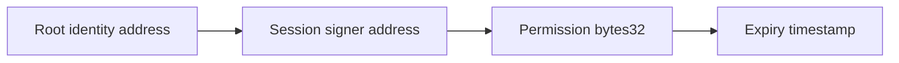

The public registry surface includes:

```solidity
function login(address signer, uint256 expiry, bytes32[] permissions, string origin) external;
function loginAndFund(address payable signer, uint256 expiry, bytes32[] permissions, string origin) external payable;
function revoke(address signer, bytes32[] permissions, string origin) external;
function authorizationExpiry(address user, address signer, bytes32 permission) external view returns (uint256);
```

The registry emits:

```solidity
event AuthorizationsUpdated(
  address indexed identity,
  address signer,
  uint256 expiry,
  bytes32[] permissions,
  string origin
);
```

The SDK wraps this as `SessionKey.fromSecp256k1(...)`, `login(...)`, `revoke(...)`, `syncExpirations()`, and `hasPermissions(...)`.

### 7.2 Current FOC permissions

The SDK defines four default FWSS permissions. These permissions are the `keccak256` type hashes of the corresponding EIP-712 operation types:

- `CreateDataSetPermission`
- `AddPiecesPermission`
- `SchedulePieceRemovalsPermission`
- `DeleteDataSetPermission`

The default permission set is:

```ts
DefaultFwssPermissions = [
  CreateDataSetPermission,
  AddPiecesPermission,
  SchedulePieceRemovalsPermission,
  DeleteDataSetPermission,
]
```

The registry itself is permission-hash agnostic; it can store arbitrary `bytes32` permissions. The current FWSS contracts and SDK convention use the EIP-712 type hashes above.

### 7.3 How session keys are used in Synapse

Session keys are delegated signers, not payment accounts.

In Synapse:

- the **root wallet** owns the FOC identity, funds, payment rails, and datasets;
- the **session key** signs FOC EIP-712 operation payloads;
- FOC `extraData` includes the root/payer address, operation parameters, and the session-key signature;
- FWSS can validate that the recovered signer is authorized for the relevant operation type and has not expired.

The SDK's `SessionKeyAccount` carries both:

```ts
address      // session signer address
rootAddress  // root identity / payer address
```

For dataset creation, the SDK explicitly supports a different payer when a session key signs:

```ts
createDataSet(sessionKey.client, {
  payer: sessionKey.rootAddress,
  ...
})
```

For high-level use, `Synapse.create({ account: rootAccount, sessionKey })` validates that the session key has all default FWSS permissions before enabling it for eligible storage operations.

### 7.4 Why this matters for `foc-platform`

The FOC session-key primitive is close to the coordinator authorization model needed by `foc-platform`.

It provides:

- an existing onchain authorization registry,
- time-bounded delegation,
- operation-scoped permissions,
- revocation,
- event-based observability,
- compatibility with current Synapse SDK storage flows,
- reduced need to keep a hot root wallet online for every FOC operation.

For platform use, the most direct pattern is:

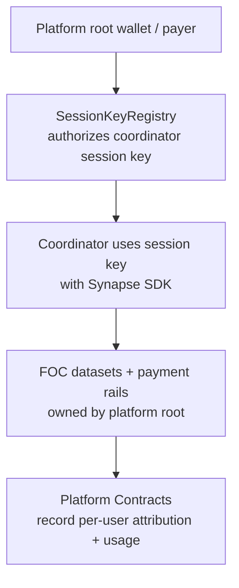

This gives the platform a safer operational model than using the root wallet directly for all uploads.

### 7.5 Recommended v1 use of session keys

For the first implementation, `foc-platform` SHOULD treat FOC session keys as the preferred authorization layer between the platform's FOC payer identity and the offchain coordinator.

Recommended v1 model:

1. Platform has a FOC payer/root wallet, likely EOA/KMS initially.
2. Platform generates one or more coordinator session keys.
3. Platform root calls `SessionKeyRegistry.login(...)` with scoped FWSS permissions and a short expiry.
4. Coordinator uses the session key with Synapse SDK for create dataset / add pieces / deletion operations.
5. Platform Contract Stack independently records upload request, user attribution, quota/billing impact, and final receipt.
6. Platform root periodically refreshes or revokes coordinator session keys.

This separates three concerns:

- FOC root identity and funds,
- operational signing by coordinator keys,
- user-level policy/accounting in Platform Contracts.

### 7.6 Session keys vs. platform user intents

FOC session keys and platform user intents solve different layers.

| Layer | Primitive | Purpose |
| --- | --- | --- |
| User -> platform | Platform EIP-712 storage intent | User authorizes the platform action and billing/quota impact. |
| Platform -> FOC coordinator | FOC session key | Platform root authorizes coordinator to perform FOC operations. |
| FOC coordinator -> provider/FWSS | Synapse signed `extraData` | Provider/FWSS verifies operation authorization. |
| Platform accounting | Platform Contracts | Track object ownership, usage, quotas, charges, and receipts. |

The platform SHOULD NOT treat a FOC session key as proof that an end user requested an upload. End-user authorization should remain in the Platform Contract Stack.

### 7.7 Contract-wallet considerations

Session keys currently appear EOA/secp256k1-oriented in the SDK. The SDK creates session keys from private keys and signs EIP-712 payloads as a local account.

Open compatibility questions remain:

- Can the root identity be a smart account or contract wallet that calls `SessionKeyRegistry.login(...)`?
- Does FWSS validate EIP-712 signatures only via ECDSA recovery, or can it support ERC-1271 smart-account signatures?
- If the root is a contract, can the session key still sign as an EOA while the payer/root address is the contract?
- Can a contract root hold USDFC, approve Filecoin Pay/Warm Storage, and own datasets/payment rails?

Until these are tested, the safest architecture is:

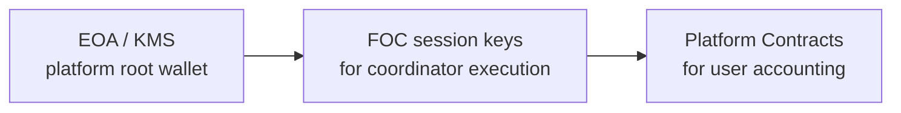

### 7.8 Spec implication

The FOC session-key primitive should be considered a first-class building block of the platform stack, but not a complete replacement for the Platform Contract Stack.

It should be used for **operator delegation into FOC**, while Platform Contracts handle **multi-tenant product semantics**.

## 8. FOC Integration Modes

Mode A is the selected v1 FOC integration mode. The remaining modes describe future targets that require Phase 0 evidence and a spec update before they become implementation scope.

### 8.1 Mode A: Platform EOA/KMS pays FOC

A platform-managed EOA signs Synapse SDK operations and pays FOC. Platform Contracts record usage and receipts.

V1 status: selected implementation target.

Pros:

- likely works with current Synapse SDK,
- fastest MVP,
- compatible with existing `foc-cli` / MCP patterns,
- easier operational recovery.

Cons:

- FOC payer is not the Platform Contract,
- requires signer custody/KMS,
- trust bridge between FOC transactions and platform receipts.

### 8.2 Mode B: Platform smart account pays FOC

A smart account is the FOC payer and uses account abstraction or ERC-1271-compatible signing.

V1 status: compatibility-gated.

Pros:

- stronger onchain custody/accounting story,
- programmable wallet policies,
- easier multi-admin controls.

Cons:

- depends on FOC/Synapse/provider compatibility,
- may require SDK changes,
- may require ERC-1271 support in auth paths.

### 8.3 Mode C: Platform treasury contract pays FOC directly

A Platform Treasury or Platform Contract holds USDFC and directly calls Filecoin Pay / Warm Storage contracts.

V1 status: compatibility-gated.

Pros:

- most onchain-native model,
- minimal custody outside contracts.

Cons:

- may not be compatible with provider HTTP auth flows,
- contract cannot upload bytes,
- likely needs custom integration beyond the current SDK.

### 8.4 Mode D: Users pay FOC directly, platform records usage

User wallets perform FOC payments/operations directly while Platform Contracts record attribution.

V1 status: deferred.

Pros:

- less platform custody,
- aligns payment responsibility with users.

Cons:

- worse UX,
- users need funds and approvals,
- platform cannot easily abstract FOC.

### 8.5 Mode E: Hybrid

The platform supports multiple modes per tenant or deployment.

V1 status: deferred.

Examples:

- free-tier users use platform wallet,
- enterprise users use dedicated smart account,
- advanced users bring their own FOC wallet.

## 9. Upload Execution and Coordinator Models

A coordinator is required for byte movement and FOC execution. Smart contracts can authorize, meter, and record storage operations, but they cannot move file bytes to providers.

This section defines the default upload lifecycle and the coordinator/data-plane options the stack should support.

### 9.1 Recommended upload lifecycle

The recommended platform-managed upload flow is:

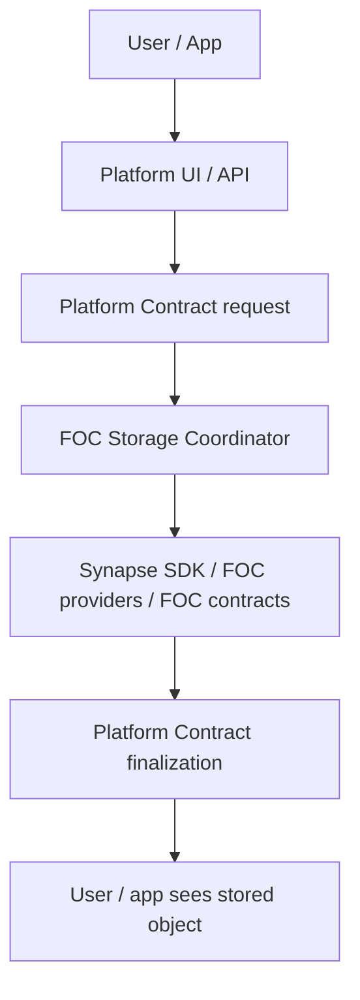

#### Step 1: Platform prepares FOC authority

Before user uploads, the platform prepares its FOC execution authority:

1. Platform has a FOC root wallet/payer.
2. Platform deposits USDFC and approves required FOC services.
3. Platform creates one or more coordinator session keys.
4. Platform root authorizes coordinator session keys in `SessionKeyRegistry` for FWSS permissions:
   - create dataset,
   - add pieces,
   - schedule removals,
   - delete dataset.

This allows a coordinator to execute FOC storage operations without using the root wallet directly.

#### Step 2: User requests upload

The user clicks upload or calls the platform API.

The platform collects:

- user identity,
- file size,
- content hash, PieceCID, or both if available,
- desired copy count,
- CDN preference,
- metadata hash,
- max acceptable cost,
- idempotency key.

The user MAY either:

- sign an EIP-712 platform storage intent, or
- authenticate with normal platform auth/API key and have the platform relay the onchain request.

#### Step 3: Platform Contract records request

The platform submits `requestUpload(...)` to its Platform Contract.

The contract checks:

- user authorization,
- nonce/idempotency,
- quota,
- prepaid balance or credit limit,
- max file size,
- max copies,
- CDN policy,
- estimated cost ceiling.

Then it records:

```text
objectId
user
size
contentHash
copies
withCDN
status = Requested
reserved balance / quota impact
```

And emits:

```solidity
event UploadRequested(
  uint256 indexed objectId,
  address indexed user,
  uint256 size,
  bytes32 contentHash,
  uint8 copies,
  bool withCDN
);
```

At this point, the platform has an onchain audit trail before storage execution.

#### Step 4: FOC Storage Coordinator picks up request

A FOC Storage Coordinator watches `UploadRequested` events or receives an equivalent platform job.

Depending on coordinator/data-plane mode, it gets bytes from one of:

- platform upload endpoint,
- temporary object store,
- browser direct stream,
- signed URL,
- FOC provider direct upload,
- local file path in dev,
- enterprise self-hosted source.

The coordinator validates:

- file size matches request,
- content hash or PieceCID matches request where available,
- request is still open,
- coordinator is allowlisted,
- FOC session key is unexpired,
- cost and copy count remain within policy.

#### Step 5: Coordinator executes FOC operation

The coordinator uses Synapse SDK with its FOC session key.

Conceptually:

```ts
const sessionKey = SessionKey.fromSecp256k1({
  privateKey: coordinatorSessionPrivateKey,
  root: platformRootAddress,
  chain,
})

const synapse = Synapse.create({
  account: platformRootAccount,
  sessionKey,
  source: "platform-id",
})
```

Then the coordinator may:

1. create/reuse storage contexts and datasets,
2. prepare/check funding if needed,
3. upload bytes to a provider, or commit bytes already uploaded directly by the user,
4. add piece to dataset,
5. create multiple copies,
6. receive PieceCID, provider IDs, dataset IDs, piece IDs, transaction hashes, and retrieval URLs.

FOC state exists under the platform root/payer, but the Platform Contract attributes it to the end user.

#### Step 6: Coordinator finalizes on Platform Contract

The coordinator calls a function such as:

```solidity
function finalizeUpload(
  uint256 objectId,
  UploadReceipt calldata receipt
) external onlyCoordinator;
```

The receipt may include:

- PieceCID or PieceCID hash,
- size,
- completed copies,
- provider IDs,
- FOC dataset IDs,
- piece IDs,
- FOC transaction hashes,
- retrieval URLs or hashes,
- actual or estimated cost,
- success / partial / failure status.

The contract checks:

- caller is an authorized coordinator,
- object is in the expected state,
- receipt is not already finalized,
- size/copy count matches policy,
- cost is within the user's signed max cost or reserved amount.

Then it updates:

```text
status = Committed | Partial | Failed
activeBytes += size * completedCopies
reservedBalance -> finalized charge or release
object receipt fields
usage counters
```

And emits:

```solidity
event UploadFinalized(
  uint256 indexed objectId,
  address indexed user,
  bytes32 pieceCidHash,
  uint256 size,
  uint8 copies,
  uint256 cost
);
```

#### Step 7: User gets result

The platform UI/API can read:

- Platform Contract state,
- emitted events,
- optional indexer/cache,
- FOC retrieval URL.

Example response:

```json
{
  "objectId": "123",
  "status": "committed",
  "pieceCid": "bafk...",
  "size": 1048576,
  "copies": 2,
  "retrievalUrl": "https://...",
  "charged": "0.00..."
}
```

#### Step 8: Failure path

If upload fails:

1. Coordinator calls `failUpload(objectId, reasonHash)`, or timeout allows user/platform to cancel.
2. Contract marks status `Failed` or `Expired`.
3. Reserved balance/quota is released or partially charged, depending on policy.
4. Event is emitted for auditability.

### 9.2 Dual authorization model

The cleanest architecture has two separate authorization flows:

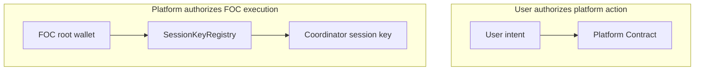

The first authorization proves the user requested the action and accepted platform policy/billing. The second authorization lets an operational coordinator perform FOC actions without exposing the platform root wallet.

This preserves the distinction between:

- **user authorization into the platform**, handled by platform auth, user intents, relays, or Platform Contracts;
- **platform authorization into FOC**, handled by root wallet, session keys, and FOC permission grants;
- **FOC protocol execution**, handled through Synapse SDK, providers, FWSS, and FOC contracts;
- **Platform Contract receipt/accounting finalization**, handled by `finalizeUpload(...)`, usage updates, and emitted accounting events.

### 9.3 Coordinator responsibilities

The coordinator MAY:

- watch `UploadRequested` events,
- accept temporary upload bytes,
- coordinate direct-to-FOC uploads,
- validate content hash/size,
- call Synapse SDK,
- create/reuse datasets,
- upload files and commit pieces,
- submit FOC transactions,
- call `finalizeUpload` on the Platform Contract,
- retry failed phases,
- emit logs/metrics.

The coordinator is not the same as the Platform Contract.

The Platform Contract answers:

- is this upload allowed?
- who owns it?
- who is charged?
- what status is it in?
- which coordinator may finalize?
- what receipt was recorded?

The coordinator answers:

- where are the bytes?
- how should they be uploaded?
- how should Synapse SDK be used?
- did FOC accept/commit the piece?
- what receipt should be finalized?

### 9.4 Statelessness requirement

The coordinator SHOULD be reconstructable from chain state.

Allowed coordinator state:

- in-memory queue,
- temporary file buffer,
- retry cache,
- idempotency cache,
- logs/metrics,
- optional non-authoritative job mirror.

Authoritative state SHOULD be in Platform Contracts and FOC contracts.

### 9.5 Coordinator model A: platform-hosted coordinator

This is the most natural v1 model for SaaS/platform companies.

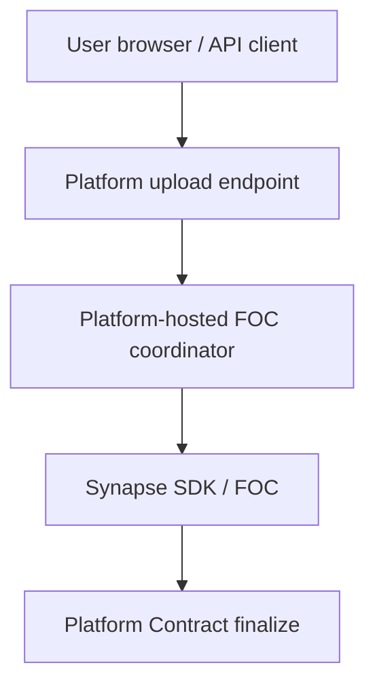

The platform maintains the coordinator as backend infrastructure.

Pros:

- best UX for users,
- user does not need FOC keys, FIL, USDFC, node setup, or CLI,
- platform can enforce file size, MIME policy, quotas, malware scanning, and rate limits,
- platform can hide FOC complexity,
- works well with platform-managed wallet/session key,
- easier to monitor and support.

Cons:

- platform temporarily handles file bytes,
- platform pays bandwidth/compute,
- coordinator is trusted to report correct receipts unless verification/challenge logic is added,
- more infrastructure burden.

Recommended v1 hosted-coordinator flow:

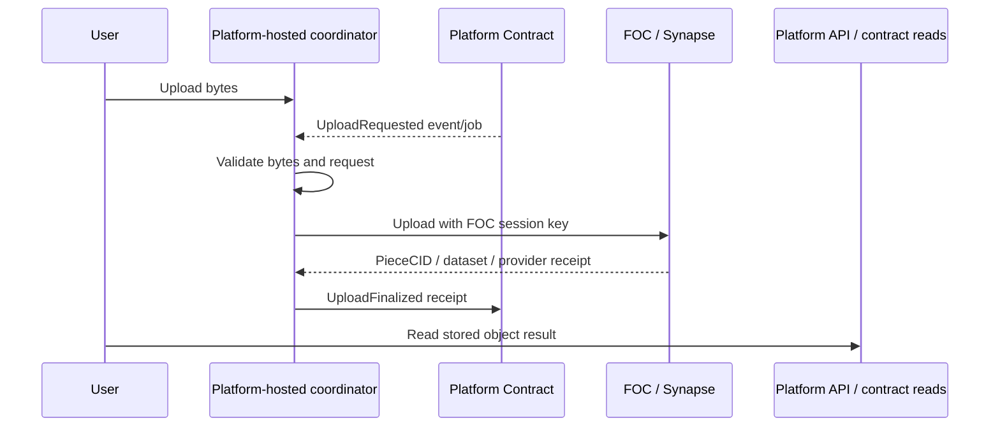

### 9.6 Coordinator model B: user-local coordinator

The coordinator runs on the user's machine, browser, desktop app, CLI, or agent.

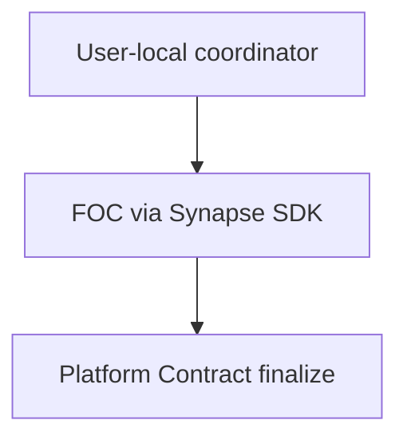

Two variants should remain possible.

#### B1. User-local coordinator using platform session key

This is generally unsafe for public users because the platform would be distributing FOC coordinator credentials.

It is **NOT RECOMMENDED** except for trusted enterprise/on-prem agents where the coordinator environment is controlled and contractual trust exists.

#### B2. User-local coordinator using user's own FOC wallet

The user pays or signs FOC operations directly.

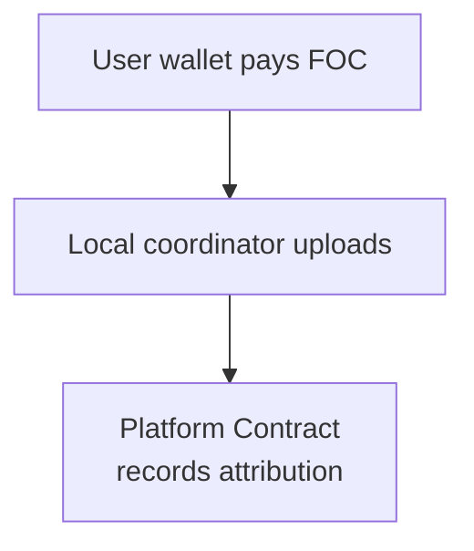

This is more decentralized but has worse UX and is no longer the primary “platform-managed wallet pays FOC” model.

Pros:

- platform does not handle file bytes,
- better for privacy or enterprise/on-prem data,
- lower platform bandwidth cost,
- can work for technical users, agents, and CLI workflows.

Cons:

- harder UX,
- user must run software,
- if platform pays, credential delegation is dangerous,
- harder support/retry/reconciliation,
- less suitable for ordinary SaaS users.

### 9.7 Coordinator model C: hybrid / bring-your-own coordinator

The platform MAY support allowlisted coordinators.

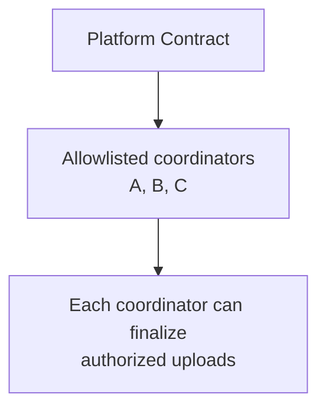

Possible coordinator types:

- platform-hosted coordinator,
- enterprise customer self-hosted coordinator,
- local dev coordinator,
- AI-agent coordinator,
- serverless worker coordinator,
- marketplace coordinator in future.

The contract may store:

```solidity
mapping(address => bool) public approvedCoordinators;
mapping(address => CoordinatorPolicy) public coordinatorPolicies;
```

A request may specify:

```solidity
address preferredCoordinator;
bytes32 coordinatorMode;
```

or the platform may assign a coordinator offchain.

Pros:

- flexible,
- lets v1 start centralized but grow toward self-hosted/decentralized execution,
- useful for enterprise customers who do not want the platform to touch bytes.

Cons:

- more complex,
- requires coordinator authorization, policies, revocation, and audit,
- requires clear responsibility for failures.

Recommended direction:

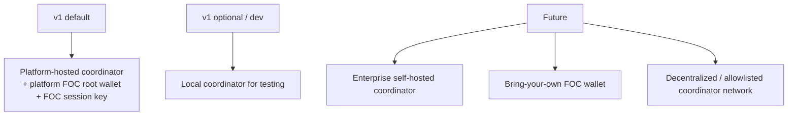

### 9.8 Direct-to-FOC upload with platform-delegated signing

A key optional architecture is **direct data plane, platform-controlled control plane**.

In this model, the platform never receives file bytes, but it still controls authorization, payment, and accounting.

This flow should usually have two distinct authorization moments:

1. **Upload ticket / plan:** the platform authorizes the user or browser to upload a specific file-shaped payload to a selected provider path. This is not broad spend authority.
2. **FOC commit authorization:** after the PieceCID/content hash is known and policy checks pass, the platform signs a narrow FOC operation-specific authorization for adding that piece to an approved dataset.

High-level flow:

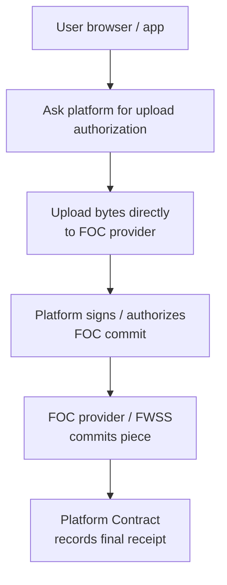

#### Step 1: User requests an upload ticket

User calls:

```http
POST /uploads/request
```

with:

- user auth/session/API key,
- file size,
- content hash or PieceCID if already computed,
- desired copies,
- CDN preference,
- max cost,
- metadata hash.

Platform checks:

- user quota/balance,
- max size,
- copies/CDN policy,
- rate limits.

Then platform records or references an onchain `UploadRequested`.

#### Step 2: Platform returns an upload plan

The platform chooses:

- FOC provider,
- dataset or new dataset plan,
- upload endpoint,
- object id,
- expected PieceCID/content hash,
- expiry,
- optional upload ticket or provider authorization token.

The upload plan SHOULD NOT include broad reusable FOC spend authority. If it includes any commit-related authorization, that authorization must be scoped to the expected PieceCID/content hash, dataset, payer/root, metadata, expiry, and max-cost policy.

Example response:

```json
{
  "objectId": "123",
  "providerId": "5",
  "serviceURL": "https://provider.example",
  "datasetId": "42",
  "expectedPieceCid": "bafk...",
  "expiresAt": 1234567890
}
```

#### Step 3: User uploads bytes directly to FOC provider

The user/browser uploads to the provider's PDP API directly:

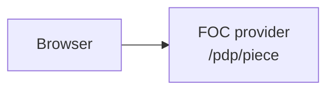

The platform does not proxy the file.

#### Step 4: Platform signs the FOC commit

The browser, coordinator, or provider needs FOC `extraData` authorizing the piece to be added to a dataset.

This is the second authorization moment. It SHOULD happen after the platform has enough information to bind the operation to the user request, especially the PieceCID or content hash. The platform keeps its root wallet/session key private and signs only the specific operation:

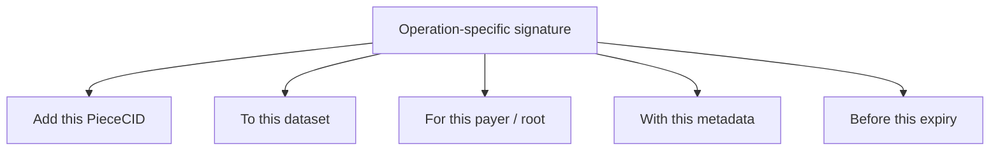

The platform SHOULD sign using a FOC session key rather than the root wallet. The platform MUST NOT give the user the platform wallet key or a general coordinator session key. It only returns a narrow operation-specific signature or arranges for the coordinator to submit it.

#### Step 5: Commit happens

Two variants should remain possible.

**Variant A: browser submits commit to provider**

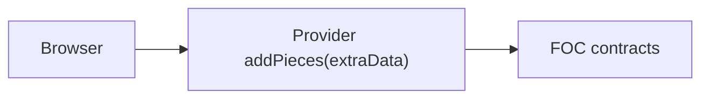

The browser coordinates the flow but cannot change what the platform signed.

**Variant B: platform coordinator submits commit**

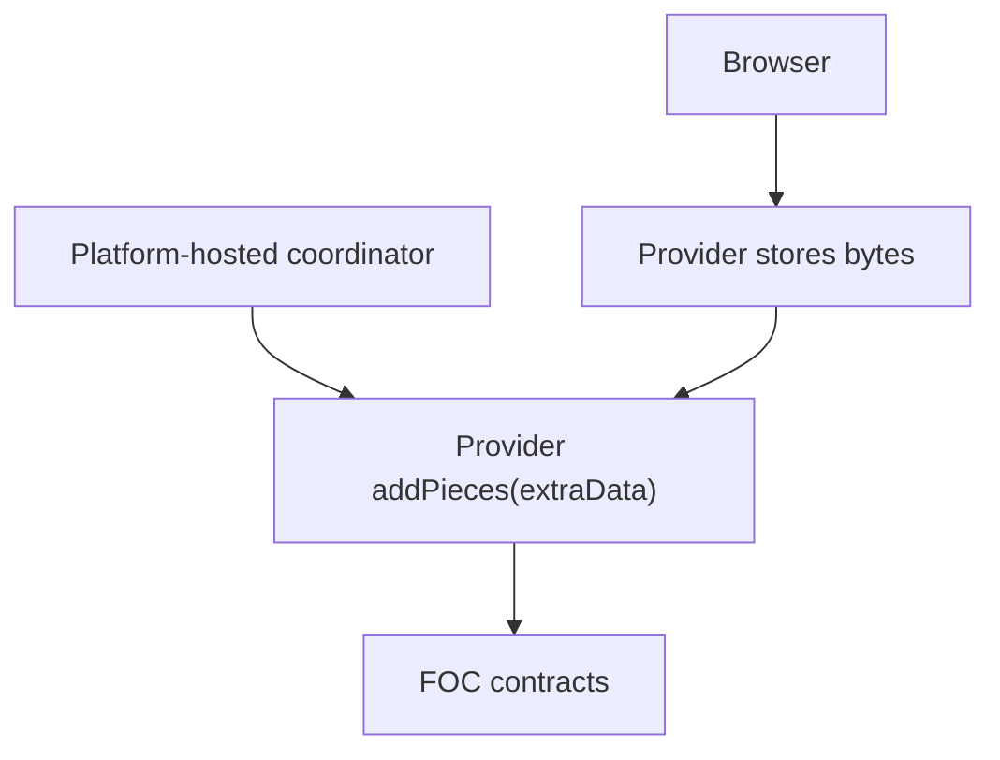

The platform still never sees file bytes. The coordinator only commits the already-uploaded PieceCID. This is likely the safer v1 direct-upload model.

#### Step 6: Platform finalizes receipt

Once FOC confirms the piece, the platform records:

- object id,
- user,
- PieceCID,
- size,
- provider id,
- dataset id,
- FOC transaction hash,
- charge/quota impact.

Either:

- platform coordinator calls `finalizeUpload`, or
- user submits receipt and platform verifies or accepts it under policy.

Recommended direct-upload v1:

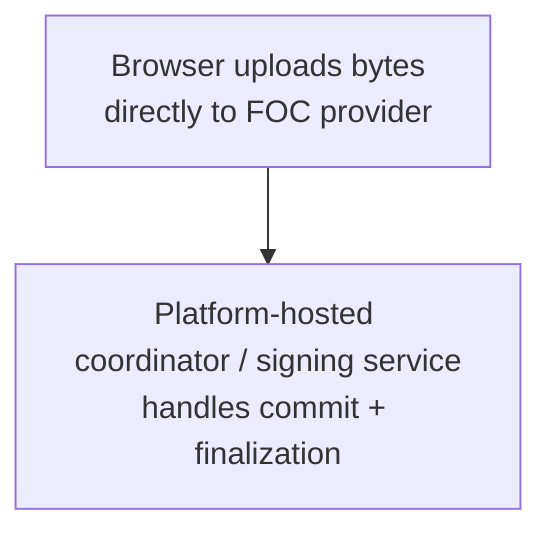

This gives the platform less byte-handling responsibility while preserving platform control over wallet, signing, and accounting.

Caveats to test:

- provider CORS supports browser direct upload,
- browser can compute PieceCID efficiently for large files,
- provider direct upload APIs work from web clients,
- Synapse SDK supports split direct-upload / delegated-commit flow cleanly in browser,
- commit signatures can be safely issued after quota/policy checks,
- retry/failure behavior when upload succeeds but commit fails,
- direct upload can be bound to an onchain `objectId` and cannot be replayed to spend platform funds unexpectedly.

### 9.9 Coordinator trust model

V1 uses a single platform-operated or platform-managed allowlisted coordinator. The following remain post-v1 options:

1. multiple allowlisted coordinators,
2. coordinator staking/slashing,
3. user-submitted finalization with verifiable FOC receipts,
4. optimistic finalization with challenge window.

The v1 coordinator is trusted for finalization but must leave enough onchain evidence for reconciliation and audit.

### 9.10 Finalization receipt design

The Platform Contract Stack needs a compact but useful receipt shape for `finalizeUpload(...)`. The normative v1 receipt structs and events are defined in section 6.7. This section explains the rationale: implementations should preserve enough information to reconstruct the user-facing object, audit FOC transactions, and reconcile platform usage with FOC payment state.

The v1 receipt model stores compact hashes and ids in contract storage and emits copy-level event detail. The minimum receipt evidence is:

- PieceCID hash,
- object size,
- requested and completed copy counts,
- payer address,
- provider ids,
- dataset ids,
- piece ids,
- add-piece or commit transaction hashes,
- retrieval URL hashes when retrieval URLs are known,
- receipt hash for any richer offchain receipt artifact.

Post-v1 receipt choices:

- whether any production mode needs full PieceCID strings in contract storage rather than events or offchain receipt artifacts,
- whether all copy receipts must remain in storage or can move to events under a cheaper indexing model,
- whether FOC contract events can be verified onchain,
- whether FOC payment rail IDs should be stored directly or reconstructed from dataset IDs and FOC views.

## 10. Token Host Builder Integration

Token Host Builder is the preferred v1 scaffold for the platform app surface. The current builder already has useful substrate for this stack:

- THS schema validation and generated EVM CRUD app output,
- generated UI and onchain indexing,
- Filecoin Calibration and Filecoin mainnet chain targets,
- image/upload fields and Filecoin Onchain Cloud upload metadata,
- generated Netlify upload scaffolding for `filecoin_onchain_cloud`,
- remote upload adapter metadata and `foc-process` upload runner support,
- manifest-driven upload runtime config,
- `userPays` and `sponsored` transaction modes.

The integration rule is strict: Token Host Builder should generate or scaffold as much of the app, operator, upload, manifest, indexing, and transaction UX as possible, but the section 6.7 protocol semantics remain the source of truth. If generic CRUD generation cannot express a lifecycle rule, authorization rule, receipt shape, or accounting invariant, the plan must call for a generated custom FOC module or a hand-written Platform Contract wrapped by generated Token Host UI and adapters.

### 10.1 Current builder baseline

The platform plan should assume these current Token Host Builder capabilities are available for v1 scaffolding:

- `apps/example/microblog.schema.json` demonstrates Filecoin Calibration-oriented generated UI with image fields, upload features, onchain indexing, and Netlify Filecoin upload configuration.
- `docs/examples-microblog-netlify-upload.md` documents generated Netlify upload artifacts for `POST /__tokenhost/upload` and polling through `/__tokenhost/upload-status`.
- `docs/examples-microblog-remote-upload.md` and `examples/upload-adapters/foc-remote-adapter.mjs` document a standalone remote adapter and `foc-process` mode backed by `foc-cli upload`.
- `packages/templates/next-export-ui/src/lib/manifest.ts`, `upload.ts`, and `tx.ts` provide generated UI runtime hooks for upload metadata and sponsored transactions.
- `packages/cli/src/index.ts` wires Filecoin chain names, upload runner metadata, generated Netlify artifacts, local preview upload behavior, and `--tx-mode auto|userPays|sponsored`.

This baseline is enough for v1 app scaffolding and demos. It is not yet enough evidence that generic CRUD generation can replace the `FocPlatformRegistry` lifecycle in section 6.7.

### 10.2 Compatibility matrix

| Section 6.7 concept | Token Host Builder baseline | Status | V1 plan |
| --- | --- | --- | --- |
| Filecoin chain target | CLI supports `filecoin_calibration` and `filecoin_mainnet` generation/deploy/verify paths. | Current support | Use for generated demo/app scaffolding and Calibration validation. |
| Upload UI and image fields | THS supports `image` fields and `app.features.uploads`; generated UI blocks save/submit until uploads finish. | Current support | Use for the first generated storage demo surface. |
| Upload adapter metadata | Manifest carries upload provider, runner mode, endpoint, status URL, accepted types, and max bytes. | Current support | Extend with FOC Platform coordinator/account/dataset/copy metadata. |
| Netlify FOC upload scaffold | Builder emits Netlify functions and `NETLIFY-UPLOADS.md` when schema opts into Filecoin upload deployment. | Current support, runtime proof pending | Use as a scaffold path, but do not mark production-ready until deployed and validated. |
| Remote/`foc-process` upload runner | Standalone adapter can run local or `foc-process` mode backed by `foc-cli upload`. | Current support | Use for early coordinator prototypes; production should prefer direct Synapse SDK or hosted coordinator integration. |
| Transaction UX | Manifest and generated UI support `userPays` and `sponsored` modes. | Current support | Use for generated UX; production relay policy remains a platform security decision. |
| `RequestUploadParams` | Generic schema fields can represent pieces of the form; platform-specific `accountId`, idempotency, max cost, expiry, requested copies, and CDN policy need first-class semantics. | THS extension needed | Add `app.focPlatform` fields and generated form/relay mapping. |
| `StorageObject` | Generated collections can store object-like records, but status transitions, compact receipts, reservation fields, and coordinator ownership are protocol-specific. | Generated custom module needed | Generate read/admin views now; require a custom module or hand-written registry for production semantics. |
| `AccountUsage` | Generic collections/indexes do not currently prove aggregate quota, reserved cost, active byte, and finalized/failure counter invariants. | Generated custom module needed | Use generated dashboards against contract views/events; implement accounting in section 6.7 surface. |
| `CopyReceipt` and `UploadReceipt` | Upload runtime returns URL/CID/provider-style metadata, but section 6.7 needs provider ids, dataset ids, piece ids, tx hashes, receipt hashes, multi-copy counts, and finalization status. | Hand-written platform contract needed | Keep receipt structs in the platform contract until builder has a custom FOC module. |
| `CoordinatorPolicy` | Current builder has upload runner configuration but not allowlisted coordinator policy with expiry and permissions hash. | Generated custom module needed | Treat coordinator policy as Platform Contract state; generate admin UI only after mapping is specified. |
| `DatasetRecord` | Current Filecoin upload examples know the provider class, but do not model per-account dataset attribution and multi-copy provider tuples. | THS extension needed | Add manifest/schema fields for account, dataset, provider, storage class, CDN, and copy policy. |
| `PolicyConfig` | Builder can generate config/admin surfaces, but platform quota/cost/TTL/failure-charge rules are not generic CRUD rules. | Generated custom module needed | Generate operator controls around the section 6.7 policy surface. |
| Lifecycle functions | Generic CRUD covers create/update/delete-like flows, not `requestUpload`, `startUpload`, `finalizeUpload`, `failUpload`, `cancelUpload`, and `expireUpload` with constrained callers and terminal states. | Generated custom module needed | Do not replace section 6.7 with generic CRUD. Generate a custom FOC Platform module or wrap hand-written contracts. |
| Events and custom errors | Builder can emit generic contract events; section 6.7 requires domain events and errors for reconciliation and UX. | Generated custom module needed | Preserve the section 6.7 events/errors in any generated production module. |
| Platform API endpoints | Generated app upload endpoints exist for Token Host upload runtime; FOC Platform API also needs request/status/object/usage endpoints bound to contract state. | THS extension needed | Generate the browser/admin/read surfaces, then bind them to platform API/coordinator endpoints. |
| Reconciliation/admin views | Generated UI can render collections and custom pages; current FOC-specific reconciliation views are not built. | THS extension needed | Generate object receipt, usage, dataset/copy, coordinator, and runway views from the platform manifest. |

### 10.3 Schema extension contract

The builder should grow an explicit `app.focPlatform` extension rather than overloading generic app fields. Draft surface:

```json
{
  "app": {
    "features": {
      "focPlatformStorage": true,
      "onChainUsageLedger": true,
      "sponsoredTransactions": true,
      "uploads": true
    },
    "focPlatform": {
      "paymentMode": "platformWallet | smartAccount | contractTreasury | userPays | hybrid",
      "billingMode": "prepaid | credit | quotaOnly | hybrid",
      "coordinatorMode": "hosted | netlify | remote | worker | foc-process | foc-sdk | browser-assisted",
      "defaultCopies": 2,
      "allowCDN": true,
      "accountIdSource": "wallet | platformUserHash | apiRelay",
      "idempotency": "required",
      "receiptMode": "compactHashWithEvents",
      "datasetStrategy": "perAccountProviderClass",
      "contractMode": "handWrittenRegistry | generatedFocModule | genericCrudPrototype"
    }
  }
}
```

### 10.4 Generated collections and indexes

Token Host Builder SHOULD generate collections and indexes for app/read/admin scaffolding even when the authoritative v1 contract is hand-written. Required generated or generated-view concepts:

- `StorageObject`,
- `UploadRequest`,
- `AccountUsage`,
- `UsageEvent`,
- `DatasetRecord`,
- `ProviderCopy`,
- `Coordinator`,
- `BillingPlan`.

Useful indexes and generated read paths:

- objects by account/user,
- objects by status,
- objects by content or PieceCID hash,
- requests by account/idempotency key,
- requests by status and expiry,
- usage events by account,
- datasets by account/provider/storage class/CDN mode,
- copies by object/provider/dataset,
- coordinator records by address and expiry.

### 10.5 Generated UI/admin

Token Host Builder SHOULD emit:

- user object browser,
- upload form,
- admin usage dashboard,
- coordinator status view,
- treasury balance view,
- FOC account runway view,
- object detail with PieceCID/provider/dataset receipts.

The first useful admin surface should not wait for all production contract generation. It can read a hand-written `FocPlatformRegistry` ABI and generated manifest metadata while builder work continues toward a custom FOC module.

### 10.6 Upload adapter and coordinator evolution

Current Token Host upload adapters can prototype FOC upload via `foc-cli`. Production SHOULD prefer direct Synapse SDK integration.

Potential coordinator modes:

1. `foc-process`: shell out to `foc-cli` for quick prototype.
2. `foc-sdk`: direct Synapse SDK coordinator.
3. `remote`: platform-hosted upload service.
4. `netlify`: generated Netlify functions and background worker scaffold.
5. `worker`: background worker / serverless queue.
6. `browser-assisted`: client uploads bytes, coordinator finalizes.

The generated upload contract between browser/app, adapter, coordinator, and Platform Contract should include:

- upload endpoint and status endpoint,
- account id source and relayer policy,
- object/request id mapping,
- declared size/content commitment,
- requested copy count and CDN mode,
- coordinator mode,
- finalization callback target,
- receipt hash/copy receipt shape,
- failure and retry semantics.

### 10.7 Builder follow-up issues

Focused `tokenhost/tokenhost-builder` child issues are open for the confirmed builder gaps:

- [tokenhost-builder#79](https://github.com/tokenhost/tokenhost-builder/issues/79): `app.focPlatform` schema and manifest extension,
- [tokenhost-builder#80](https://github.com/tokenhost/tokenhost-builder/issues/80): FOC Platform registry lifecycle generation or wrapper mode,
- [tokenhost-builder#81](https://github.com/tokenhost/tokenhost-builder/issues/81): generated FOC Platform admin and reconciliation surfaces,
- [tokenhost-builder#82](https://github.com/tokenhost/tokenhost-builder/issues/82): receipt-aware upload runner path.

## 11. Synapse SDK Requirements / Opportunities

Potential SDK support needed:

- platform/backend examples,
- explicit upload receipt type suitable for contract finalization,
- deterministic cost quote helpers,
- contract-wallet compatibility docs,
- smart-account examples,
- KMS signer examples,
- dataset metadata strategy for multi-tenant platforms,
- receipt/reconciliation helpers,
- optional coordinator-friendly APIs for split upload phases,
- documented session-key coordinator pattern,
- session-key lifecycle helpers for backend services,
- short-lived coordinator key examples,
- clear description of which operations require FWSS permissions and which require payment/operator approvals.

## 12. `foc-cli` and `foc-storage-mcp` Roles

### 12.1 `foc-cli`

Should remain useful for:

- local testing,
- platform operator diagnostics,
- wallet setup,
- dataset inspection,
- upload prototyping,
- JSON output consumed by early adapters.

Potential additions:

- `foc-cli platform doctor`,
- `foc-cli platform receipt`,
- `foc-cli platform reconcile`,
- `foc-cli upload --receipt-format platform`.

### 12.2 `foc-storage-mcp`

Should remain useful for AI-agent operations, but reusable logic may be extracted for platform use:

- pricing,
- balance checks,
- payment preparation,
- upload orchestration,
- provider selection summaries.

Potential package split:

- `@fil-b/foc-storage-core`,
- `@fil-b/foc-storage-mcp`,
- `@fil-b/foc-platform-coordinator`.

## 13. Compatibility Spike Requirements

Before production contract implementation, run compatibility tests on Calibration and complete the Phase 0 Compatibility Report Template below. The v1 default remains platform EOA/KMS payer plus session-key coordinator unless the report proves that this path is not viable.

Required questions:

1. Can a contract hold USDFC and deposit into Filecoin Pay?
2. Can a contract approve Warm Storage as operator?
3. Can a contract be payer on payment rails?
4. Can a smart account execute Synapse SDK upload flows?
5. Do FOC provider HTTP auth flows require EOA signatures?
6. Is ERC-1271 supported or needed?
7. Can Synapse session keys be rooted in a smart account or contract wallet?
8. Can an EOA session key sign for a contract root/payer if the contract root authorized it through `SessionKeyRegistry.login(...)`?
9. Does FWSS validate session-key authorization based only on the recovered signer plus root/payer address, or are there implicit EOA assumptions about the root?
10. Does `loginAndFund` matter for coordinator session keys on Filecoin, or should coordinator keys remain unfunded except for gas edge cases?
11. What expiry duration is appropriate for production coordinators?
12. Can FOC receipts be compactly represented and verified by a Platform Contract?
13. What minimum data must be stored onchain to reconstruct user/object usage?
14. What gas costs result from storing full receipts vs. compact hashes/events?

Recommended test cases:

1. **EOA root + session-key coordinator upload**: platform EOA deposits/approves FOC, authorizes a coordinator session key, uploads a file, and finalizes a Platform Contract receipt.
2. **Per-user dataset attribution**: two platform users upload through the same platform root wallet, but each upload lands in user-attributable FOC datasets and Platform Contract records.
3. **Direct-to-FOC browser upload**: browser uploads bytes directly to a provider, platform signs a scoped commit authorization after PieceCID/content hash is known, and a coordinator finalizes the receipt.
4. **Contract root session-key authorization**: Platform Contract or smart account calls `SessionKeyRegistry.login(...)`; test whether an EOA session key can sign FOC operations for that root/payer.
5. **Contract treasury payment path**: contract holds USDFC, approves/deposits into Filecoin Pay, and attempts to be payer for a dataset/payment rail.
6. **Smart account / ERC-1271 path**: smart account signs or validates FOC typed data, if supported, and attempts dataset creation/add-pieces flow.
7. **Provider direct-upload/CORS path**: browser performs provider upload without platform byte proxying; verify CORS, upload status, and failure behavior.
8. **Receipt compaction path**: finalize with compact hashes and event data, then reconstruct PieceCID/copy/provider/dataset/payment evidence from chain views.
9. **Reconciliation path**: intentionally create a mismatch between Platform Contract receipt state and FOC dataset/payment state, then detect and classify it.
10. **Session-key expiry/revocation path**: coordinator operation fails after expiry or revoke; platform observes and recovers by refreshing authorization.

Deliverable:

- a completed compatibility report using section 13.1,
- transaction hashes or logs for every required test,
- recommended v1 payment mode,
- recommended v1 coordinator mode,
- required SDK changes, if any.

### 13.1 Phase 0 Compatibility Report Template

Each Phase 0 run MUST produce a Markdown report using this template. The report is a production-readiness gate for the v1 spec.

```markdown
# Phase 0 Compatibility Report

Date:
Author/operator:
Network:
Chain ID:
FOC environment:
foc-platform commit:
synapse-sdk commit/version:
foc-cli commit/version:
foc-storage-mcp commit/version:
Coordinator branch/commit:
Platform root/payer address:
Coordinator session key address:
SessionKeyRegistry address:
Warm Storage address:
Filecoin Pay address:
USDFC address:

## Final Recommendation

Recommended v1 payment mode: PASS/FAIL - platform EOA/KMS payer
Recommended v1 coordinator mode: PASS/FAIL - platform-hosted coordinator with FOC session key
Recommended v1 contract mode: PASS/FAIL - registry/usage/receipt contracts, no contract treasury custody
Recommended v1 dataset mode: PASS/FAIL - per-account/provider dataset attribution
Modes gated out of v1:
Required SDK changes before v1:
Required contract changes before v1:
Required operator runbook changes before v1:

## Required Compatibility Matrix

| ID | Question/test | Required evidence | Result | Tx hash(es) / log link(s) | SDK gaps | Notes |
| --- | --- | --- | --- | --- | --- | --- |
| T1 | EOA root + session-key coordinator upload | Root funds/approves FOC, grants session key, coordinator uploads and commits one object. | PASS/FAIL |  |  |  |
| T2 | Per-user dataset attribution | Two accountIds upload through same payer; receipts identify separate account/provider dataset attribution. | PASS/FAIL |  |  |  |
| T3 | Compact receipt finalization | Platform registry finalizes with piece hash, provider id, dataset id, piece id, payer, add-piece tx hash, and receipt hash. | PASS/FAIL |  |  |  |
| T4 | Reconciliation | A report reconstructs platform object/usage state from Platform Contract events and FOC dataset/payment state. | PASS/FAIL |  |  |  |
| T5 | Session-key expiry/revocation | Coordinator action fails after expiry or revoke; refreshed authorization recovers cleanly. | PASS/FAIL |  |  |  |
| F1 | Contract root session-key authorization | Contract or smart account calls `SessionKeyRegistry.login(...)`; EOA session key attempts FOC operation for that root. | PASS/FAIL/N/A |  |  | Future-mode gate |
| F2 | Contract treasury payment path | Contract holds USDFC, approves/deposits into Filecoin Pay, and attempts payer flow. | PASS/FAIL/N/A |  |  | Future-mode gate |
| F3 | Smart account / ERC-1271 path | Smart account signs or validates required FOC typed data and attempts dataset/add-piece flow. | PASS/FAIL/N/A |  |  | Future-mode gate |
| F4 | Direct browser-to-FOC upload | Browser uploads directly to provider; CORS, auth, status, and failure behavior are recorded. | PASS/FAIL/N/A |  |  | Future-mode gate |

## Required Transaction Evidence

- Session-key login tx:
- Filecoin Pay deposit/approval tx:
- Dataset creation tx(s):
- Add-piece/commit tx(s):
- Platform upload-request tx:
- Platform finalize/fail tx:
- Session-key revoke or expiry evidence:
- Reconciliation report artifact:

If a required action does not create a transaction, link the SDK log, provider response, or script output and explain why no tx exists.

## SDK and Tooling Gaps

| Repo | Gap | Blocks v1? | Proposed fix | Owner | Issue/PR |
| --- | --- | --- | --- | --- | --- |
| synapse-sdk |  | YES/NO |  |  |  |
| foc-cli |  | YES/NO |  |  |  |
| foc-storage-mcp |  | YES/NO |  |  |  |
| foc-platform |  | YES/NO |  |  |  |

## Failure and Timeout Findings

- Upload request expiry behavior:
- Coordinator retry behavior:
- Partial-copy behavior:
- Provider failure behavior:
- Session-key expiry/revoke behavior:
- Reconciliation mismatch behavior:

## Decision Log

| Decision | Ship in v1 / Gate / Defer | Evidence | Follow-up |
| --- | --- | --- | --- |
| Platform EOA/KMS payer | Ship in v1 / Gate / Defer |  |  |
| Session-key coordinator | Ship in v1 / Gate / Defer |  |  |
| Contract treasury payer | Ship in v1 / Gate / Defer |  |  |
| Smart-account payer | Ship in v1 / Gate / Defer |  |  |
| Direct browser upload | Ship in v1 / Gate / Defer |  |  |
| Token Host Builder scaffolding | Ship in v1 / Gate / Defer |  |  |
| Token Host generated FOC module | Ship in v1 / Gate / Defer |  |  |
```

## 14. MVP Options

### 14.1 Selected v1 target: Fast path, EOA payer + onchain registry

- Platform KMS/EOA pays FOC.
- Contracts track users, objects, requests, and usage.
- Coordinator is trusted and allowlisted.
- Token Host Builder generates or scaffolds the app, admin/read UI, upload adapters, manifest metadata, and transaction UX around the platform contract/API surface.

This is the canonical v1 implementation path for this spec revision. Token Host Builder is first-class for scaffolding and demos, but the production contract/API surface in section 6.7 is the source of truth until a generated FOC Platform module proves compatibility.

### 14.2 Post-v1 option: Prepaid treasury + EOA executor

- Users deposit USDFC into platform treasury.
- Contract reserves/debits user balances.
- Platform EOA still executes FOC operations.
- Treasury may reimburse executor or simply account for liabilities.

This gives stronger billing/accounting semantics.

### 14.3 Compatibility-gated option: Smart-account payer

- Platform smart account pays FOC.
- Contracts/policies control smart account execution.
- Requires compatibility confirmation.

This is more onchain-native but higher risk.

### 14.4 First scaffold path: Token Host generated platform app

- Use Token Host Builder to generate a Filecoin Calibration demo app.
- Image uploads go through FOC coordinator.
- Object/usage state is either read from the hand-written section 6.7 registry or stored in a generated prototype that is clearly marked non-production until compatibility is proven.
- Good for public demo, admin/read UX, upload adapter validation, sponsored transaction UX, and iterative design.

## 15. Security Considerations

Required protections:

- nonce/replay protection for intents,
- upload size limits,
- content hash validation,
- coordinator allowlist or proof model,
- user quota checks,
- platform pause switch,
- admin role separation,
- private key isolation for any EOA/KMS coordinator,
- no sensitive PII in onchain metadata,
- idempotent finalization,
- duplicate PieceCID/object handling policy,
- cost quote slippage controls.

Post-v1 security decisions:

- whether finalization needs a challenge period,
- whether receipts must be independently verifiable onchain instead of coordinator-submitted and reconciled,
- whether coordinators stake collateral,
- whether user deposits are refundable immediately in a future treasury mode,
- whether failed uploads may charge users for provider-accepted partial work beyond the v1 policy in section 6.7.9.

## 16. Data Minimization

Recommended onchain storage:

- object id,
- user address or opaque account id hash,
- content hash,
- PieceCID or PieceCID hash,
- size,
- status,
- copies count,
- compact provider/dataset receipt or receipt hash,
- billing counters.

Avoid onchain:

- raw user email,
- customer name,
- private filename,
- unencrypted business metadata,
- sensitive content descriptors,
- API keys,
- temporary upload URLs.

## 17. Reconciliation and Audit Model

The Platform Contract Stack and FOC onchain state must remain reconcilable. The goal is not merely to write platform receipts, but to ensure that platform-visible usage, user attribution, and billing state can be checked against actual FOC datasets, pieces, payment rails, and transaction receipts.

### 17.1 Sources of truth

The intended source-of-truth model is:

- **FOC contracts and provider-confirmed FOC transactions** are the source of truth for actual FOC storage commitments, datasets, pieces, payment rails, and payment state.
- **Platform Contracts** are the source of truth for platform product semantics: which user requested an object, who owns it in the platform, what quota/billing impact was recorded, and which FOC receipt was attributed to that user.
- **Coordinator state, platform API databases, logs, and indexers** are not authoritative. They may improve UX and operations, but they must be reconstructable or reconcilable from onchain state.

### 17.2 Required synchronization properties

For each finalized upload, the Platform Contract Stack should be able to prove or reconstruct:

1. The platform user or opaque user-id hash associated with the object.
2. The object id and request that authorized the upload.
3. The PieceCID or PieceCID hash committed to FOC.
4. The FOC provider ids, dataset ids, and piece ids used for each completed copy.
5. The FOC transaction hashes or event evidence for dataset creation/add-pieces operations.
6. The FOC payer/root wallet and payment rail state associated with the dataset.
7. The platform usage/billing delta applied to the user.

The onchain FOC payment state and the corresponding Platform Contract receipt/usage state should be:

- **in sync**: Platform Contract records should correspond to actual FOC datasets, pieces, and payment rails;
- **source-of-truth aligned**: FOC contracts are authoritative for FOC protocol/payment facts, while Platform Contracts are authoritative for user attribution and platform billing semantics;
- **auditable to user identity**: every recorded FOC object/copy/payment attribution should trace back to a platform user address or opaque user-id hash without exposing sensitive PII.

### 17.3 Reconciliation process

A reconciliation process, whether manual, CLI-driven, or automated, should:

1. Read finalized Platform Contract object receipts.
2. Query FOC datasets, pieces, provider ids, and payment rails through Synapse SDK / FOC views.
3. Compare Platform Contract usage counters against FOC piece sizes and copy counts.
4. Compare recorded payer/root, dataset ids, provider ids, and transaction hashes against FOC state.
5. Detect missing receipts, orphan FOC datasets, failed/partial copies, unexpected payment rails, and stale coordinator jobs.
6. Emit an auditable reconciliation report that can be tied to platform user ids or opaque user-id hashes.

Open reconciliation choices:

- whether reconciliation is a CLI command, background worker, Token Host generated admin view, or all of these;
- whether mismatches trigger automatic corrective transactions or only operator alerts;
- whether per-user FOC dataset allocation is required for all production modes or can be relaxed under explicit product constraints.

## 18. Open Questions

The v1 decisions are defined in the V1 Architecture Decisions section and section 6.7. Some remaining questions are post-v1 or compatibility-gated decisions; the Token Host Builder questions in section 18.5 are v1 planning questions because the builder is now the preferred scaffolding path.

### 18.1 Payment, custody, and delegation

1. Which future FOC payer modes should be added after platform EOA/KMS: platform smart account, contract treasury, user-pays wallet, or a hybrid model?
2. Should direct root signing remain an emergency operator mode after session-key coordinator execution is stable?
3. Can a smart account or contract wallet safely be the root identity for FOC session keys and payment rails?
4. What evidence would justify adding contract-custodied USDFC after v1?
5. How much of FOC payment rail state should be mirrored in the Platform Contract?

### 18.2 User authorization and billing semantics

1. Which v1 authorization paths should be required in the first prototype versus documented as supported by the contract surface?
2. Which post-v1 billing modes should be added first: prepaid, token-gated/subscription-based, or hybrid?
3. Should any future prepaid balance mode reserve or release funds differently from the v1 quota/credit policy?
4. What cost-slippage and max-cost guarantees should the user receive before the platform spends FOC funds?

### 18.3 Coordinator placement and data plane

1. What evidence would justify adding direct-to-FOC browser upload after the platform-hosted coordinator is working?
2. Which coordinator roles can safely run in the browser or user-local environment in post-v1 deployments, and which must remain platform-controlled?
3. What enterprise/BYO coordinator model is worth preserving in v1 interfaces even if not implemented immediately?
4. Should uploads be synchronous from the API perspective, async/event-driven by default, or support both with polling/webhook patterns?

### 18.4 Receipts, verification, and reconciliation

1. Should any future mode store full PieceCID strings, or should v1 compact hashes remain the long-term default?
2. Which provider/dataset copy receipt fields should move from events to storage as production query needs become clear?
3. What evidence would justify replacing trusted allowlisted coordinator finalization with a challenge/proof/user-submitted receipt path?
4. What reconciliation guarantees are required for production if offchain coordinator state is non-authoritative?

### 18.5 Implementation path and generated stack

1. Which minimum custom FOC Platform module should Token Host Builder generate first, and which section 6.7 semantics should remain hand-written until proven?
2. What is the minimum useful admin UI for a platform operator: account runway, coordinator status, object receipts, usage ledger, or all of these?
3. Which deployment should be the canonical first demo: Calibration platform-hosted coordinator with Token Host generated app, Netlify upload scaffold, remote adapter, or a combined demo?
4. Which choices should be fixed before writing production contracts, and which can remain runtime configuration?

## 19. Proposed Phases

### Phase 0: Research and compatibility

- Complete the Phase 0 Compatibility Report Template in section 13.1.
- Prove the platform EOA/KMS payer plus session-key coordinator path on Calibration.
- Collect transaction hashes and logs for contract-wallet, treasury, smart-account, browser-direct, expiry, and reconciliation gates.
- Document current Synapse SDK assumptions and identify required SDK changes.
- Complete the Token Host Builder compatibility matrix in section 10.2 against the current builder checkout and open focused child issues for confirmed builder gaps.
- Validate the smallest current Token Host Builder Filecoin upload scaffold after installing builder dependencies, such as `th build apps/example/microblog.schema.json --chain filecoin_calibration --out /tmp/foc-platform-th-audit --no-ui`.

### Phase 1: Token Host scaffold plus onchain registry prototype

- Implement the v1 contract/API surface in section 6.7.
- Add upload request, start, finalize, fail, cancel, and expire flows.
- Build the allowlisted hosted coordinator with Synapse SDK and FOC session keys.
- Store object, receipt, copy, dataset, and usage state onchain.
- Generate or scaffold the first Token Host Builder app/admin/read surface against the v1 contract/API surface.
- Wire generated upload adapter metadata and transaction mode metadata into the platform demo.

### Phase 2: Token Host Builder custom module/productization

- Add the `app.focPlatform` schema extension or reference example schema.
- Generate the FOC Platform custom module if the compatibility matrix shows it can match section 6.7 semantics.
- Integrate generated admin/reconciliation views with the platform registry and coordinator.
- Add Filecoin Calibration deployment path.

### Phase 3: Billing/treasury modes

- Add prepaid balances and/or credit ledger.
- Add admin quotas and policy controls.
- Add reconciliation tooling.

### Phase 4: Advanced payment/wallet mode

- Add smart-account or contract-treasury FOC payer if compatible.
- Add stronger finalization proof model if needed.

### Phase 5: Production hardening

- KMS/HSM support.
- Monitoring and alerts.
- Coordinator scaling.
- Audit.
- Documentation and reference platform integration.

## 20. Success Criteria

The buildout is successful when:

1. A platform can offer storage to users without designing its own FOC billing/accounting backend from scratch.
2. User object ownership and usage are reconstructable from onchain state/events.
3. Offchain coordinator state is not authoritative.
4. Uploads can be attributed to users and charged or quota-enforced.
5. FOC payment/runway health is observable.
6. The stack supports at least one working managed-wallet mode on Calibration.
7. The design remains extensible to smart-account or contract-treasury modes.
8. Token Host Builder can generate or scaffold the first platform app, admin/read UI, upload adapter wiring, manifest metadata, and transaction UX.
9. Any gap between current Token Host Builder output and section 6.7 production semantics is documented in the compatibility matrix and, when concrete, linked to focused `tokenhost-builder` child issues.
